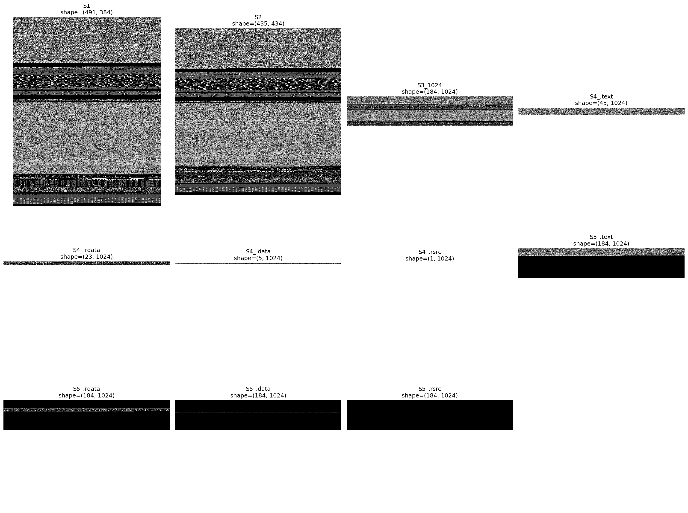
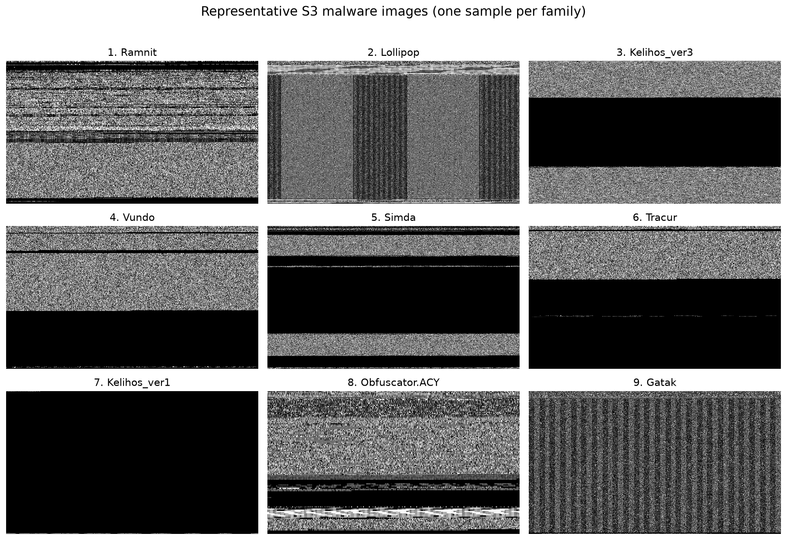

# Malware Classification Based on Image Segmentation

Reproducible PyTorch implementation of Wanhu Nie's 2024 paper, **[Malware Classification Based on Image Segmentation](paper.pdf)** ([arXiv:2406.03831](https://arxiv.org/abs/2406.03831)). The project converts the Microsoft Malware Classification Challenge (BIG 2015) byte streams into grayscale images, separates PE sections into image channels, fine-tunes VGG16 and ResNet50, and produces Kaggle-compatible probability submissions.

> **Scope.** This is a static-analysis pipeline: it reads the `.bytes` and `.asm` files supplied by BIG 2015 and does not execute malware. The dataset is nevertheless untrusted research material; keep it outside the repository and handle it in an isolated environment.

## Method at a glance

Malware bytes become grayscale intensities. The method uses texture and layout patterns from the whole file or four PE sections: `.text`, `.rdata`, `.data`, and `.rsrc`.

| Scheme | Representation | Intended information |
|---|---|---|
| **S1** | Original bytes; width selected from Nataraj et al.'s file-size table | Conventional adaptive-width baseline |
| **S2** | Original bytes; width is approximately the square root of file size | Variable-width baseline |
| **S3** | Original bytes at a fixed width of 1,024 | Fixed-width texture and layout |
| **S4 (Split)** | Each selected PE section is compacted into a separate 1,024-wide channel | Section texture without whole-file spatial layout |
| **S5 (Mask)** | One full-size channel per section; non-section pixels are zeroed | Partial spatial layout, at the cost of sparse channels |

S1-S3 are repeated into three channels; S4/S5 use section combinations. VGG16 supports six three-channel configurations, while ResNet50 supports all 14 committed combinations. Inputs are resized to 224 x 224 and ImageNet-normalized.



S4 compacts section bytes; S5 preserves their positions and masks everything else.

## Dataset

[Microsoft Malware Classification Challenge (BIG 2015)](https://www.kaggle.com/c/malware-classification) contains 10,868 labeled training samples and 10,873 unlabeled test samples from nine imbalanced families.

| Class | Family | Training samples | Class | Family | Training samples |
|---:|---|---:|---:|---|---:|
| 1 | Ramnit | 1,541 | 6 | Tracur | 751 |
| 2 | Lollipop | 2,478 | 7 | Kelihos_ver1 | 398 |
| 3 | Kelihos_ver3 | 2,942 | 8 | Obfuscator.ACY | 1,228 |
| 4 | Vundo | 475 | 9 | Gatak | 1,013 |
| 5 | Simda | 42 |  | **Total** | **10,868** |



Each pixel represents one byte; black regions may be padding or masked content.

## Installation on a new machine

Requirements: Python 3.10+, 7-Zip, a Kaggle account with accepted competition rules, and roughly 80-100 GB of storage. An NVIDIA GPU is strongly recommended for the full experiment.

On Ubuntu, install 7-Zip with `sudo apt install p7zip-full`. If needed, install a CUDA-compatible PyTorch build for the local driver.

```bash
git clone https://github.com/ta-tahmasebi/image-segmentation.git
cd image-segmentation

python3 -m venv .venv
source .venv/bin/activate
python -m pip install --upgrade pip
pip install -e .

malware-seg --version
malware-seg --help
```

The package installs the `malware-seg` command. `requirements.txt` supports non-editable environments; `requirements-dev.txt` adds Ruff.

```bash
DATA_DIR=~/.cache/kaggle/BIG2015/main
malware-seg download --data-dir "$DATA_DIR"
```

Alternatively, place manually downloaded `train.7z`, `test.7z`, and `trainLabels.csv` directly in `DATA_DIR`.

### Preprocess once

Preprocessing pairs `.asm` and `.bytes` files and writes compressed S1-S5 arrays. It skips existing `.npz` files unless `--overwrite` is used.

```bash
malware-seg preprocess train --data-dir "$DATA_DIR"
malware-seg preprocess test  --data-dir "$DATA_DIR"

# Optional: render 10 deterministic examples per class.
malware-seg visualize --data-dir "$DATA_DIR" --samples-per-class 10
```

The manifests under `DATA_DIR/processed` should report 10,868 training and 10,873 test samples.

## Reproduce the experiments

```bash
malware-seg configs vgg16
malware-seg configs resnet50
```

To reproduce the reported paper-epoch experiments, run:

```bash
malware-seg run-all \
  --data-dir "$DATA_DIR" \
  --device cuda
```

`run-all` expects preprocessed data. It trains and predicts every supported configuration using the paper defaults:

| Model | Epochs | Effective batch | Initial LR | Scheduler | Weight decay | Momentum |
|---|---:|---:|---:|---|---:|---:|
| VGG16 | 20 | 8 | 0.001 | None | 0.0005 | 0.9 |
| ResNet50 | 15 | 64 | 0.01 | Exponential decay, gamma 0.9 | 0.006 | 0.9 |


## Results

The best paper result is ResNet50/S3 with 0.0265 log loss. In the paper-epoch reproduction, the best Public score is 0.02341 and the best Private score is 0.03185, both from mixed S5 ResNet50 configurations.

See **[full results, comparisons, and training diagnostics](RESULTS.md)**.

## Output layout

All runtime outputs are rooted at the selected `--data-dir`:

```text
DATA_DIR/
├── train.7z, test.7z, trainLabels.csv
├── processed/
│   ├── train/<class>/<sample>.npz
│   ├── train/manifest.json
│   ├── test/<sample>.npz
│   └── test/manifest.json
└── artifacts/
    ├── visualizations/class_<n>/<sample>.png
    ├── models/<model>/
    │   ├── model_comparison.{csv,png}
    │   └── <configuration>/
    │       ├── model.pt, metrics.json, history.csv
    │       ├── classification_report.csv, training_predictions.csv
    │       └── training_curves.png, confusion_matrices.png, ...
    └── submissions/<model>/
        ├── prediction_comparison.{csv,png}
        └── <configuration>/
            ├── submission.csv, predictions.csv, summary.json
            └── class_distribution.png, prediction_uncertainty.png, ...
```

`submission.csv` is the file to upload to Kaggle. Test confidence and entropy plots are label-free diagnostics; they are **not** accuracy estimates.

## Citation

```bibtex
@article{nie2024malware,
  title   = {Malware Classification Based on Image Segmentation},
  author  = {Nie, Wanhu},
  journal = {arXiv preprint arXiv:2406.03831},
  year    = {2024}
}
```
