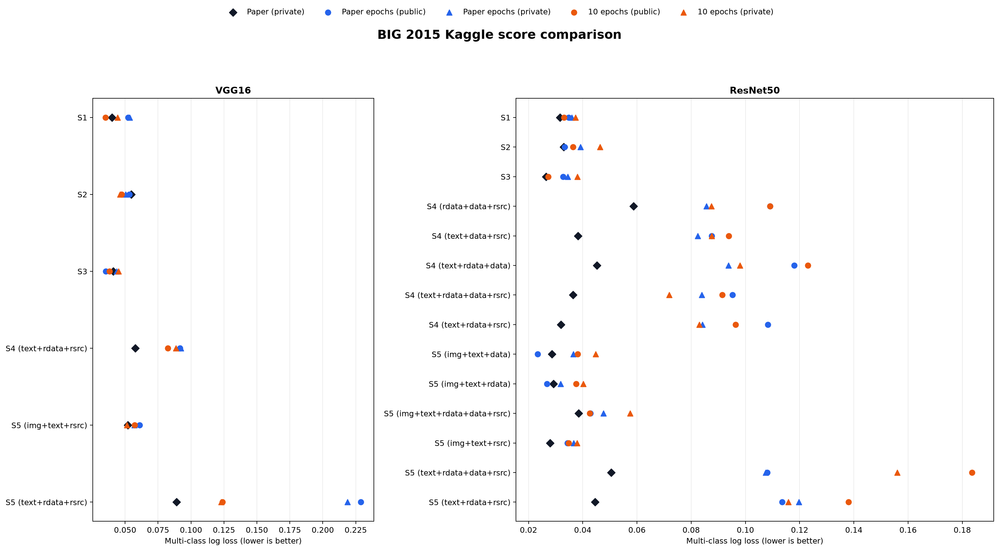
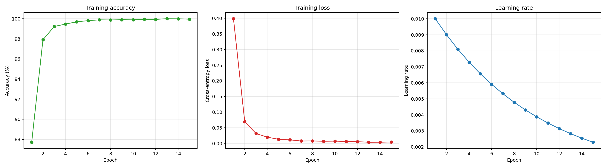
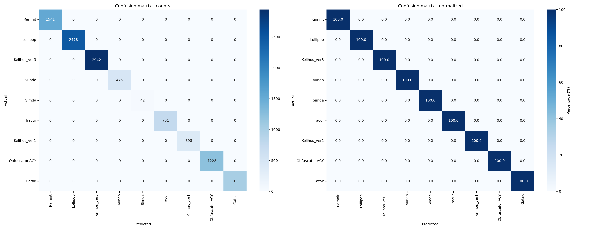

# Results

The competition metric is multi-class logarithmic loss; **lower is better**. Kaggle's Public score uses 30% of the test set and the Private score uses the remaining 70%. Table 5 in the paper reports one test log loss, described as the Private score. Each reproduction cell below is **Public / Private**.

## Table 5 reproduction

| Model | Configuration | Paper train accuracy | Paper log loss | Reproduction, paper epochs | Reproduction, 10 epochs |
|---|---|---:|---:|---:|---:|
| VGG16 | S1 | 99.98% | 0.0401 | 0.05234 / 0.05337 | **0.03516 / 0.04423** |
| VGG16 | S2 | 99.94% | 0.0547 | 0.05314 / 0.05046 | **0.04724 / 0.04627** |
| VGG16 | S3 | 99.94% | 0.0411 | **0.03540 / 0.04365** | 0.03816 / 0.04489 |
| VGG16 | S4 (.text + .rdata + .rsrc) | 99.95% | 0.0577 | 0.09152 / 0.09226 | **0.08238 / 0.08861** |
| VGG16 | S5 (imgs-1024 + .text + .rsrc) | 99.99% | 0.0521 | 0.06101 / 0.05709 | **0.05714 / 0.05128** |
| VGG16 | S5 (.text + .rdata + .rsrc) | 99.84% | 0.0889 | 0.22894 / 0.21883 | **0.12396 / 0.12295** |
| ResNet50 | S1 | 100.00% | 0.0316 | 0.03477 / **0.03601** | **0.03310** / 0.03735 |
| ResNet50 | S2 | 100.00% | 0.0330 | **0.03332 / 0.03916** | 0.03646 / 0.04641 |
| ResNet50 | S3 | 100.00% | 0.0265 | 0.03279 / **0.03446** | **0.02722** / 0.03800 |
| ResNet50 | S4 (.rdata + .data + .rsrc) | 99.30% | 0.0587 | 0.10914 / **0.08559** | **0.10909** / 0.08747 |
| ResNet50 | S4 (.text + .data + .rsrc) | 99.99% | 0.0383 | **0.08761 / 0.08244** | 0.09386 / 0.08761 |
| ResNet50 | S4 (.text + .rdata + .data) | 99.93% | 0.0452 | **0.11796 / 0.09371** | 0.12306 / 0.09793 |
| ResNet50 | S4 (.text + .rdata + .data + .rsrc) | 99.91% | 0.0364 | 0.09528 / 0.08388 | **0.09141 / 0.07185** |
| ResNet50 | S4 (.text + .rdata + .rsrc) | 99.97% | 0.0320 | 0.10825 / 0.08410 | **0.09633 / 0.08297** |
| ResNet50 | S5 (imgs-1024 + .text + .data) | 99.98% | 0.0286 | **0.02341 / 0.03650** | 0.03819 / 0.04478 |
| ResNet50 | S5 (imgs-1024 + .text + .rdata) | 100.00% | 0.0292 | **0.02683 / 0.03185** | 0.03756 / 0.04019 |
| ResNet50 | S5 (imgs-1024 + .text + .rdata + .data + .rsrc) | 99.97% | 0.0385 | 0.04285 / **0.04764** | **0.04258** / 0.05745 |
| ResNet50 | S5 (imgs-1024 + .text + .rsrc) | 99.98% | 0.0279 | **0.03432 / 0.03660** | 0.03485 / 0.03786 |
| ResNet50 | S5 (.text + .rdata + .data + .rsrc) | 99.93% | 0.0505 | **0.10811 / 0.10746** | 0.18355 / 0.15599 |
| ResNet50 | S5 (.text + .rdata + .rsrc) | 99.95% | 0.0446 | **0.11357** / 0.11978 | 0.13806 / **0.11584** |

## Main observations

- The paper's best result is ResNet50/S3 at 0.0265.
- In the paper-epoch reproduction, ResNet50/S5 (`imgs-1024 + .text + .data`) has the best Public score (0.02341), while ResNet50/S5 (`imgs-1024 + .text + .rdata`) has the best Private score (0.03185).
- The best 10-epoch Public result is ResNet50/S3 (0.02722), and its best Private result is ResNet50/S1 (0.03735). More epochs are not uniformly better, but the paper-epoch run gives the strongest overall Private score.
- Only VGG16/S2 improves on its corresponding paper result in the paper-epoch reproduction's Private scores (0.05046 versus 0.0547).
- S4 and section-only S5 configurations reproduce poorly relative to S1-S3 and mixed S5 variants, consistent with the costs of discarded layout, sparse inputs, and altered pretrained channels.
- These are single-run Kaggle scores. Confidence intervals require multiple seeds, and Public/Private values evaluate different hidden subsets.

## Training-set diagnostics

The training code reports last-epoch training accuracy/loss, then evaluates the final model on the **same full training set** for macro F1, per-class metrics, and confusion matrices. These are implementation checks, not validation/test accuracy.

| Model/configuration | Epochs | Last-epoch train accuracy | Train loss | Full-train macro F1 | Time |
|---|---:|---:|---:|---:|---:|
| VGG16/S3 | 20 | 99.9448% | 0.001642 | 0.9981 | 63.0 min |
| ResNet50/S3 | 15 | 99.9540% | 0.004349 | 1.0000 | 16.3 min |
| ResNet50/S5 (imgs-1024 + .text + .data), best Public | 15 | 99.9632% | 0.004347 | 1.0000 | 15.6 min |
| ResNet50/S5 (imgs-1024 + .text + .rdata), best Private | 15 | 99.9816% | 0.004494 | 1.0000 | 15.4 min |

The perfect post-training S3 confusion matrix and 99.954% last-epoch accuracy use different evaluation moments: the latter is accumulated while weights change, whereas the former uses the final frozen weights. Both remain training-set results. Detailed precision, recall, and F1 are in the generated `classification_report.csv`; a compact visualization is at [`assets/resnet50-s3-per-class-metrics.png`](assets/resnet50-s3-per-class-metrics.png).

[Back to README](../README.md)
