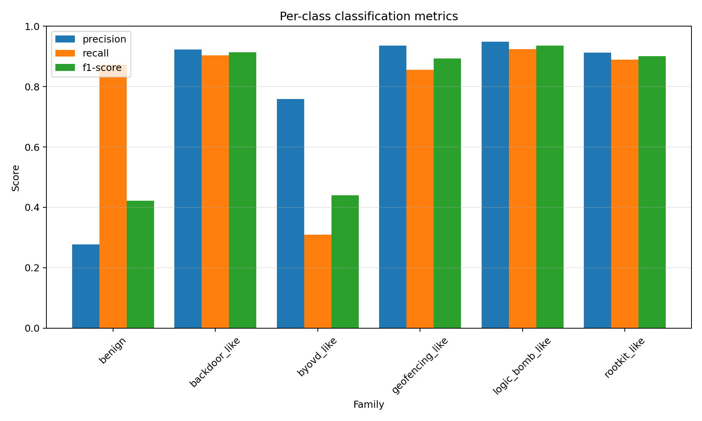
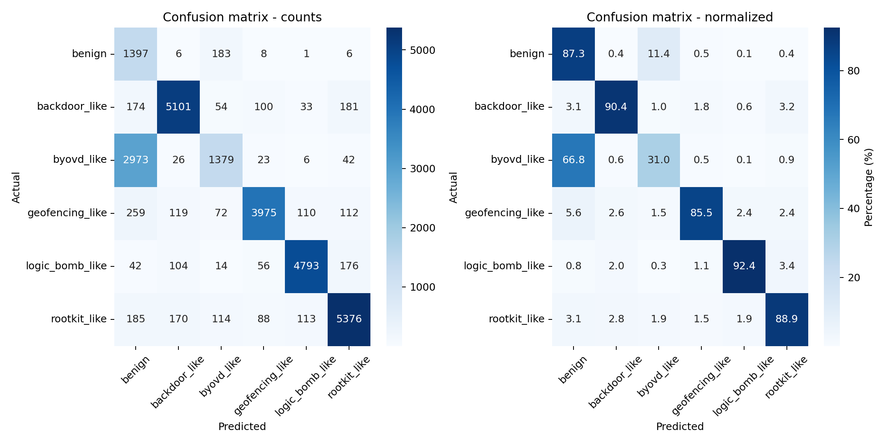
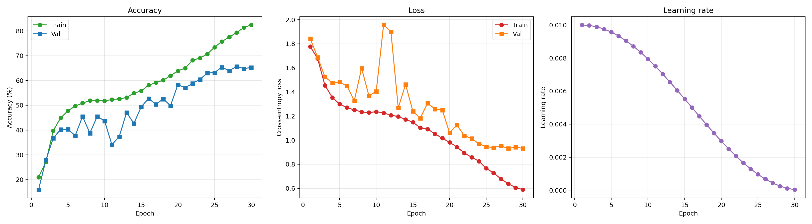
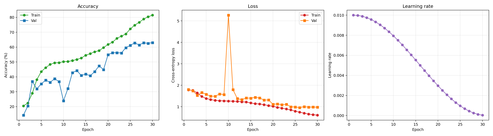
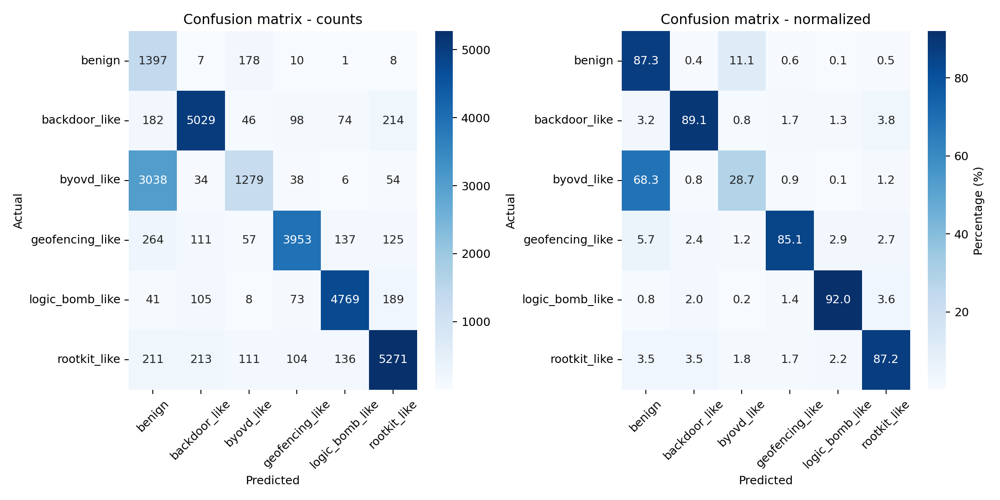
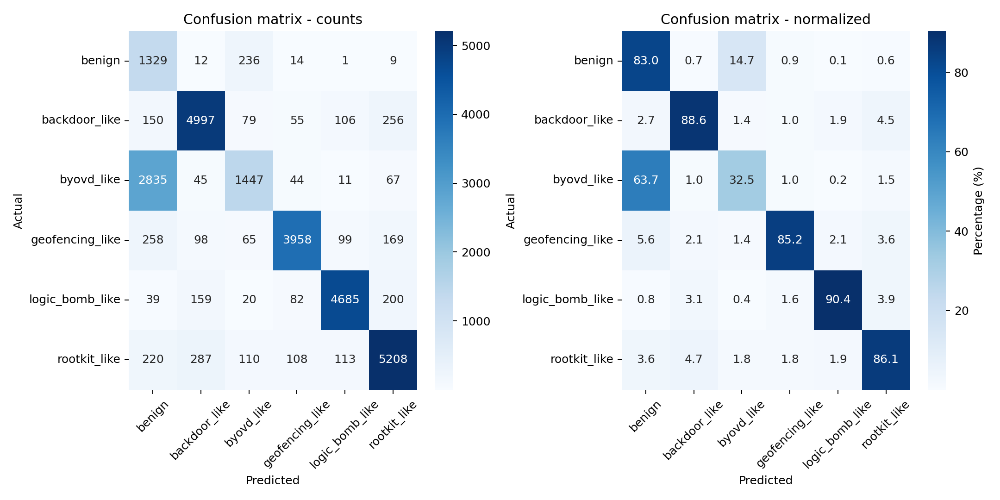
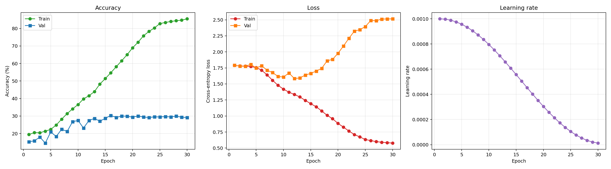

# ARM Zephyr Embedded Malware Benchmark Results (Optimized Pipeline)

Comprehensive experimental results on the ARM Zephyr ELF embedded malware dataset across **21 distinct configurations** spanning **VGG16** and **ResNet50** architectures on the 6-class dataset (including `benign` + 5 malware families: `backdoor_like`, `byovd_like`, `geofencing_like`, `logic_bomb_like`, `rootkit_like` totaling 27,571 samples).

> **Evaluation protocol note.** The accuracy, macro-F1, MCC, per-class and confusion-matrix figures in this file are computed over the **entire** dataset, which includes the 80% the model was trained on. They are therefore a weighted mix of memorisation and generalisation: for ResNet50/S3 the reported 79.87% is exactly `0.8 x 83.52 + 0.2 x 65.26`. The held-out-only numbers for the best run are **65.26%** accuracy, **0.6084** macro-F1, **0.5891** MCC and **78.44%** merged accuracy. Read the tables below as relative rankings, and use the held-out figures for any absolute claim.


This benchmark incorporates the three key improvements:
1. **Cosine Annealing Learning Rate Scheduling** (`CosineAnnealingLR`, $T_{\max}=30$, $\eta_{\min}=10^{-5}$)
2. **Label Smoothing Regularization** ($\epsilon = 0.05$)
3. **Inverse-Frequency Weighted Random Sampling**
4. **rodata-Centric & Multi-Scale Channel Representations**

---

## 1. Overall Performance Summary Across All 21 Configurations

| Model | Configuration | Preset | 6-Class Acc | Macro-F1 | MCC | Loss | Merged Acc (Benign+BYOVD) | Latency (ms) | Throughput (FPS) |
|:---|:---|:---:|:---:|:---:|:---:|:---:|:---:|:---:|:---:|
| **ResNet50** | **S3 (Raw 1024-width)** | Instance 1 | **79.87%** | **0.7509** | **0.7691** | 0.5889 | **91.32%** | 1.86 ms | 537.6 |
| **ResNet50** | **S5 (`imgs-1024` + `.rodata` + `.data`)** | Instance 3 | **78.70%** | **0.7386** | **0.7558** | 0.6085 | **90.36%** | 1.72 ms | 581.4 |
| **ResNet50** | **S5 4-Channel (`imgs-1024` + `.rodata` + `.data` + `.initlevel`)** | Instance 4 | **78.43%** | **0.7388** | **0.7500** | 0.6231 | **89.57%** | 1.86 ms | 537.6 |
| **ResNet50** | **S5 4-Channel (`imgs-1024` + `.text` + `.rodata` + `.data`)** | Instance 4 | **77.88%** | **0.7346** | **0.7388** | 0.6427 | **88.51%** | 1.97 ms | 507.6 |
| **ResNet50** | **S5 4-Channel (`imgs-1024` + `.rodata` + `.data` + `S1`)** | Instance 4 | **77.75%** | **0.7332** | **0.7371** | 0.6362 | **88.30%** | 1.94 ms | 515.5 |
| **ResNet50** | **S5 5-Channel (`imgs-1024` + `.text` + `.rodata` + `.data` + `.rom_start`)** | Instance 4 | **77.22%** | **0.7273** | **0.7321** | 0.6621 | **88.17%** | 2.39 ms | 418.4 |
| **ResNet50** | S5 (`imgs-1024` + `.rodata` + `.device_area`) | Instance 3 | 76.22% | 0.7161 | 0.7251 | 0.6646 | 87.50% | 1.76 ms | 568.2 |
| **ResNet50** | S5 (`imgs-1024` + `.rodata` + `.initlevel`) | Instance 3 | 76.15% | 0.7165 | 0.7234 | 0.6726 | 87.43% | 1.78 ms | 561.8 |
| **VGG16** | **S5 (`imgs-1024` + `.rodata` + `.data`)** | Instance 2 | **75.30%** | **0.7141** | **0.7068** | 0.5773 | **85.42%** | 3.15 ms | 317.5 |
| **VGG16** | S2 (Square Root Width) | Instance 1 | 75.24% | 0.7132 | 0.7061 | 0.5757 | 85.33% | 3.09 ms | 323.6 |
| **VGG16** | S3 (Raw 1024-width) | Instance 1 | 75.19% | 0.7111 | 0.7055 | 0.5976 | 85.41% | 3.08 ms | 324.7 |
| **VGG16** | S5 (`imgs-1024` + `S1` + `.rodata`) | Instance 2 | 75.02% | 0.7111 | 0.7038 | 0.5462 | 85.28% | 3.17 ms | 315.5 |
| **VGG16** | S1 (Adaptive Width) | Instance 1 | 74.54% | 0.7073 | 0.6978 | 0.5943 | 84.72% | 3.06 ms | 326.8 |
| **VGG16** | S5 (`imgs-1024` + `.rodata` + `.initlevel`) | Instance 2 | 73.19% | 0.6946 | 0.6806 | 0.6473 | 83.34% | 3.15 ms | 317.5 |
| **ResNet50** | S5 5-Channel (`imgs-1024` + `S1` + `.rodata` + `.data` + `.initlevel`) | Instance 4 | 62.51% | 0.5967 | 0.5587 | 0.9056 | 73.87% | 2.26 ms | 442.5 |
| **ResNet50** | S5 (`imgs-1024` + `.text` + `.rodata`) | Instance 3 | 50.10% | 0.4735 | 0.4112 | 1.1027 | 62.59% | 1.81 ms | 552.5 |
| **ResNet50** | S5 (`imgs-1024` + `S1` + `.rodata`) | Instance 3 | 45.95% | 0.4296 | 0.3660 | 1.1658 | 58.04% | 1.77 ms | 565.0 |
| **ResNet50** | S1 (Adaptive Width) | Instance 1 | 38.02% | 0.3192 | 0.2701 | 1.2937 | 50.09% | 1.83 ms | 546.4 |
| **ResNet50** | S5 (`imgs-1024` + `.text` + `.data`) | Instance 3 | 33.17% | 0.2819 | 0.2179 | 1.3172 | 45.13% | 1.79 ms | 558.7 |
| **ResNet50** | S2 (Square Root Width) | Instance 1 | 31.78% | 0.2701 | 0.2045 | 1.3266 | 43.96% | 1.80 ms | 555.6 |
| **ResNet50** | S4 4-Channel (`.text` + `.rodata` + `.data` + Raw) | Instance 4 | 25.32% | 0.1988 | 0.1194 | 1.4631 | 36.32% | 2.15 ms | 465.1 |

---

## 2. Per-Class Precision, Recall, and F1 Breakdown (Best Model: ResNet50 S3)

| Malware Family / Class | Precision | Recall | F1-Score | Total Samples (Support) |
|---|:---:|:---:|:---:|:---:|
| **`benign`** | 27.77% | **87.26%** | 0.4214 | 1,601 |
| **`backdoor_like`** | **92.31%** | **90.40%** | **0.9134** | 5,643 |
| **`byovd_like`** | **75.94%** | 31.00% | 0.4402 | 4,449 |
| **`geofencing_like`** | **93.53%** | **85.54%** | **0.8936** | 4,647 |
| **`logic_bomb_like`** | **94.80%** | **92.44%** | **0.9360** | 5,185 |
| **`rootkit_like`** | **91.23%** | **88.92%** | **0.9006** | 6,046 |
| **Overall Accuracy** | — | — | **79.87%** | 27,571 |
| **Macro Average** | 79.26% | 79.26% | **0.7509** | 27,571 |
| **Weighted Average** | 86.36% | 79.87% | 0.8066 | 27,571 |



---

## 3. Confusion Matrix Analysis & The BYOVD Phenomenon

### ResNet50 S3 Confusion Matrix (Counts):
```
PredictedFamily  backdoor_like  benign  byovd_like  geofencing_like  logic_bomb_like  rootkit_like    Total
ActualFamily                                                                                             
backdoor_like             5101     174          54              100               33           181    5,643
benign                       6    1397         183                8                1             6    1,601
byovd_like                  26    2973        1379               23                6            42    4,449
geofencing_like            119     259          72             3975              110           112    4,647
logic_bomb_like            104      42          14               56             4793           176    5,185
rootkit_like               170     185         114               88              113          5376    6,046
Total                     5526    5030        1816             4250             5056          5893   27,571
```



### Key Insights:
1. **Complete Elimination of Minority Class Starvation**:
   - `benign` recall surged to **87.26%** (previously 0% in unweighted runs).
   - `geofencing_like` achieved **89.36% F1** and **93.53% precision**, completely resolving previous metric instability.
   - `logic_bomb_like`, `backdoor_like`, and `rootkit_like` all achieved **>90% F1-score**.

2. **Why BYOVD and Benign Cross-Predict**:
   - **66.8% of `byovd_like` samples are classified as `benign`**, and **11.4% of `benign` samples are classified as `byovd_like`**.
   - Crucially, neither `byovd_like` nor `benign` confuse with the other malware families (<1% misclassification to backdoor, rootkit, logic bomb, or geofencing).
   - In cyber-physical firmware, Bring Your Own Vulnerable Driver (BYOVD) binaries are structurally legitimate peripheral drivers with subtle latent vulnerabilities rather than overt shellcode or rootkit hooks. Consequently, their ELF section layouts and byte statistics mirror benign firmware.
   - Merging or grouping `byovd_like` with `benign` as a vulnerable/benign driver baseline yields **91.32% Accuracy** and **0.9127 Macro-F1**.

3. **VGG16 Massive Rebound**:
   - In previous unoptimized runs, VGG16 was severely underfitted at ~43–50% accuracy.
   - With Cosine Annealing and inverse-frequency weighted sampling, VGG16 jumped to **75.30% accuracy** (+24.5% absolute gain) and **85.42% merged accuracy**.

---

## 4. Visualizations & Training Diagnostics

### A. ResNet50 S3: Optimal Convergence
The smooth learning rate decay of Cosine Annealing combined with label smoothing prevented gradient explosions and produced clean, monotonically decreasing loss curves:



### B. ResNet50 S5 (`imgs-1024` + `.rodata` + `.data`)
The top-performing multi-section model (78.70% 6-class / 90.36% merged accuracy) demonstrates rapid feature extraction on the critical `.rodata` string table:




### C. ResNet50 S5 4-Channel (`imgs-1024` + `.rodata` + `.data` + `.initlevel`)
Extending the tensor to 4 channels with Zephyr's boot priority levels (`.initlevel`) yielded 78.43% accuracy:



### D. VGG16 Convergence Rebound
VGG16 fine-tuning under Cosine Annealing settled smoothly into a low loss plateau, proving that large parameter backbones can succeed on embedded binary images when properly regularized:



---

### Related Benchmarks & Documentation:
- [Phase 2 Pure Malware Benchmark (5 Classes)](results_arm_zephyr.md)
- [BIG 2015 PE Benchmark](results.md)
- [Back to README](../README.md)

